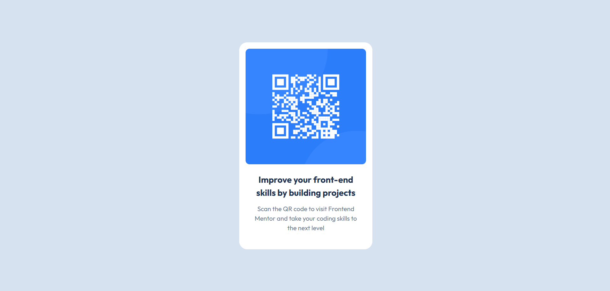

# QR code component
Esta es mi solución para el primer reto de FrontEnd Mentor, el cuál consta de realizar un componente para visualizar un codigo QR y poder centrarlo en pantalla.

## Tabla de contenidos

- [Overview](#overview)
  - [Screenshot](#screenshot)
  - [Links](#links)
- [Built with](#built-with)
- [Author](#author)

## Overview
La solución fue sencilla solo fue necesario utilizar, HTML, CSS y TailwindCSS

### Screenshot

### Links
- URL del sitio: [QR COMPONENT](https://qrcodemelvin.netlify.app/)

### Built with

- Semantic HTML5 markup
- CSS custom properties
- Flexbox
- TaiilwidCSS
- Mobile-first workflow

## Author
- Website - [Melvin Sanchez Vazquez](https://www.your-site.com)

